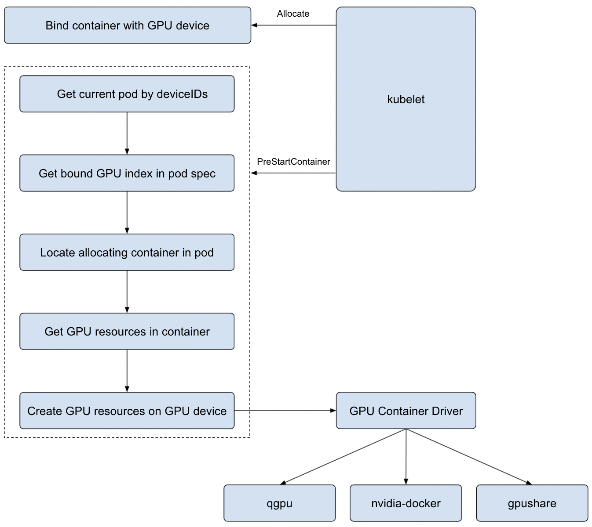

# Nano GPU Agent
## About this Project
*Nano GPU Agent* is a Kubernetes device plugin implement for gpu allocation and use in container. It runs as a Daemonset in Kubernetes node. It works as follows:
- Register gpu core and memory resources on node
- Allocate and share gpu resources for containers
- Support gpu resources qos and isolation with specific gpu driver(e.g. nano gpu)

For the complete solution and further details, please refer to Nano GPU Scheduler.

## Architecture

## Prerequisites
- Kubernetes v1.17+
- golang 1.16+
- [NVIDIA drivers](https://github.com/NVIDIA/nvidia-docker/wiki/Frequently-Asked-Questions#how-do-i-install-the-nvidia-driver) 
- [nvidia-docker](https://github.com/NVIDIA/nvidia-docker) 
  
## Build Image

Run `make` or `TAG=<image-tag> make` to build nano-gpu-agent image
## Getting Started
1.  Deploy Nano GPU Agent
```
$ kubectl apply -f deploy/nano-gpu-agent.yaml
```
**Note** To run on specific nodes instead of all nodes, please add appropriate `spec.template.spec.nodeSelector` or to `spec.template.spec.affinity.nodeAffinity` the yaml file.

2. Deploy Nano GPU Scheduler
```
$ kubectl apply -f https://raw.githubusercontent.com/nano-gpu/nano-gpu-scheduler/master/deploy/nano-gpu-scheduler.yaml
```
For more information , please refer to [Nano GPU Scheduler](https://github.com/nano-gpu/nano-gpu-scheduler).

3. Enable Kubernetes scheduler extender
Add the following configuration to `extenders` section in the `--policy-config-file` file:
```
{
  "urlPrefix": "http://<kube-apiserver-svc>/api/v1/namespaces/kube-system/services/nano-gpu-scheduler/proxy/scheduler",
  "filterVerb": "filter",
  "prioritizeVerb": "priorities",
  "bindVerb": "bind",
  "weight": 1,
  "enableHttps": false,
  "nodeCacheCapable": true,
  "managedResources": [
    {
      "name": "nano-gpu/gpu-percent"
    }
  ]
}
```

You can set a scheduling policy by running `kube-scheduler --policy-config-file <filename>` or `kube-scheduler --policy-configmap <ConfigMap>`. Here is a [scheduler policy config sample](https://github.com/kubernetes/examples/blob/master/staging/scheduler-policy/scheduler-policy-config.json).

4. Create GPU pod
```
cat <<EOF  | kubectl create -f -
apiVersion: apps/v1
kind: Deployment
metadata:
  name: cuda-gpu-test
  labels:
    app: gpu-test
spec:
  replicas: 1
  selector:
    matchLabels:
      app: gpu-test
  template:
    metadata:
      labels:
        app: gpu-test
    spec:
      containers:
        - name: cuda
          image: nvidia/cuda:10.0-base
          command: [ "sleep", "100000" ]
          resources:
            limits:
              nano-gpu/gpu-percent: "20" 
EOF
```

<!-- ROADMAP -->
## Roadmap
- Support GPU share
- Support GPU monitor at pod and container level
- Support single container multi-card scheduling
- Support GPU topology-aware scheduling
- Support GPU load-aware scheduling
- Migrate to Kubernetes scheduler framework

<!-- LICENSE -->
## License
Distributed under the Apache License.

